### StoreApp

StoreApp, kullanıcıların çeşitli ürünleri inceleyebileceği, arama yapabileceği, sepete ekleyebileceği ve satın alabileceği katmanlı bir e-ticaret platformudur. Kullanıcılar, ürün siparişi vermek istediklerinde login işlemlerini gerçekleştirirler. Ayrıca, ürün yönetimi ve sipariş takibi için yöneticilere özel bir admin paneli bulunmaktadır.

#### Özellikler

- Kullanıcı tarafından ürün arama ve listeleme
- Sepete ürün ekleme ve sepet yönetimi
- Kullanıcı girişi ve kayıt olma işlemleri
- Admin paneli üzerinden ürün yönetimi ve sipariş takibi

#### Teknolojiler

- C# ASP.NET Core MVC
- Bootstrap (Frontend tasarımı)
- JavaScript (Dinamik kullanıcı arayüzü interaksiyonları için)
- SQL Server (Veritabanı yönetimi)

#### Ekran Görüntüleri


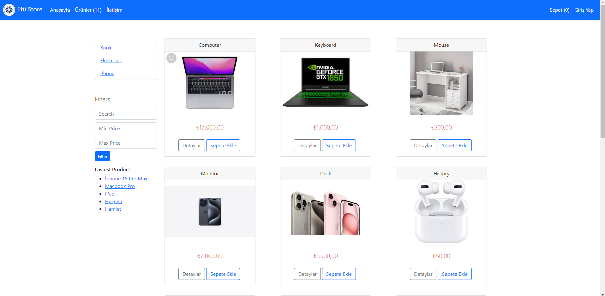
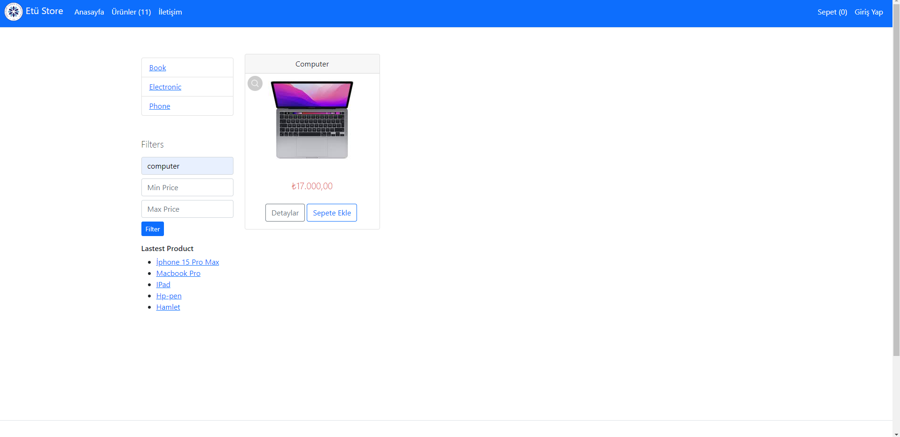
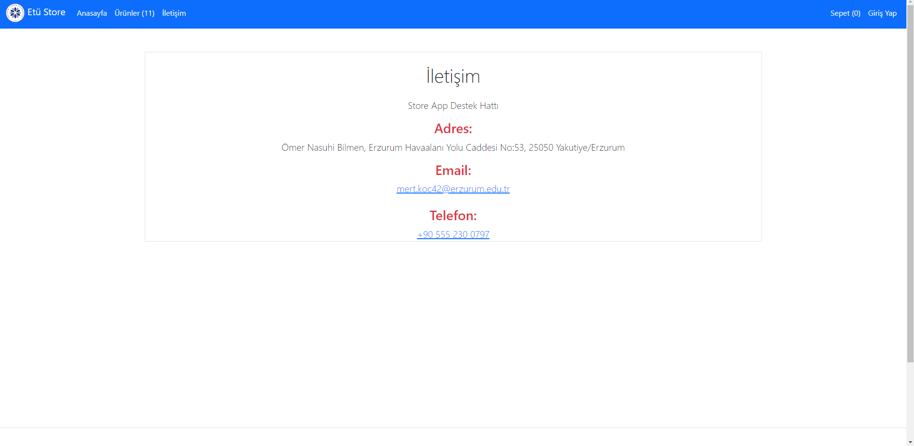
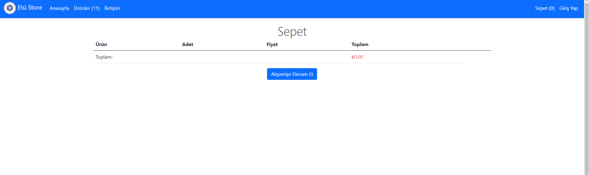
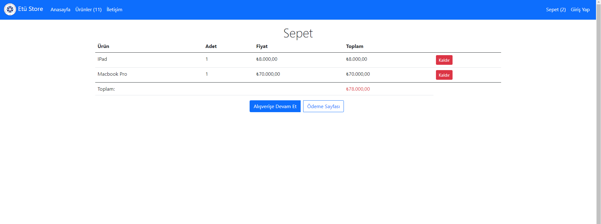
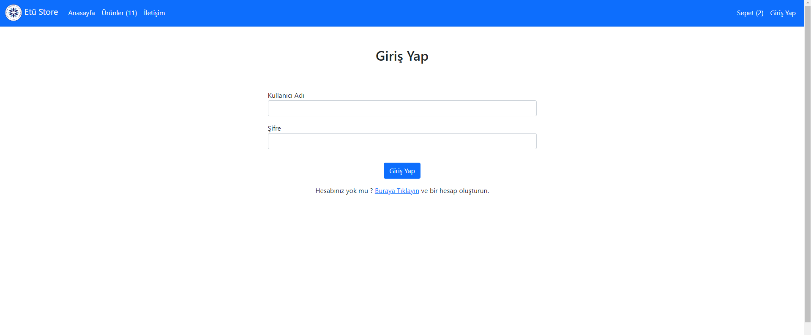
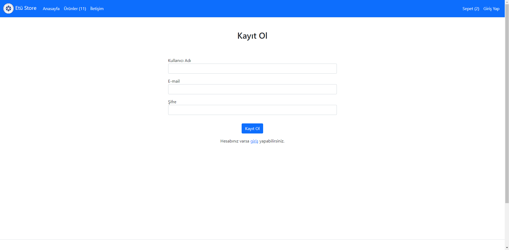

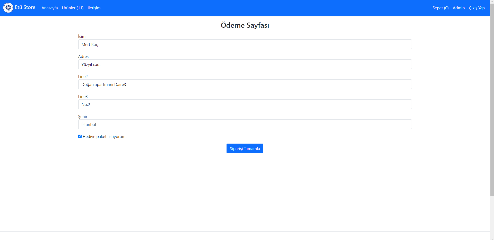
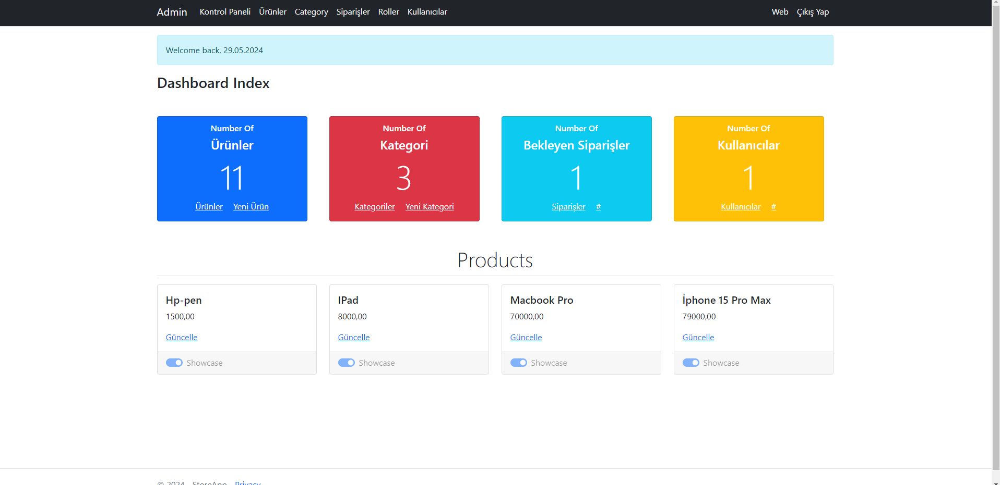
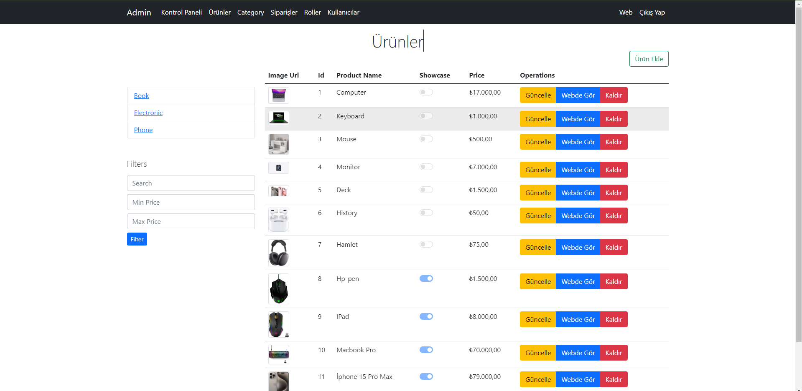
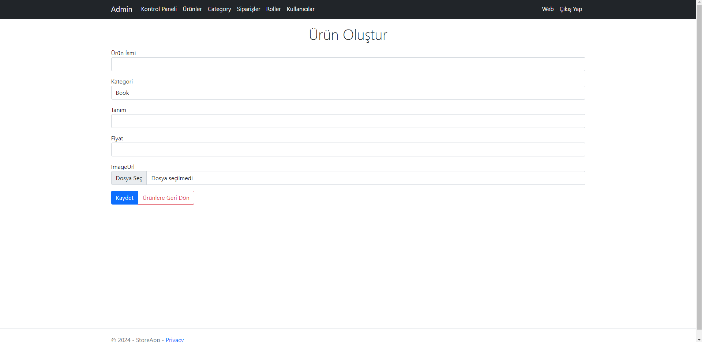
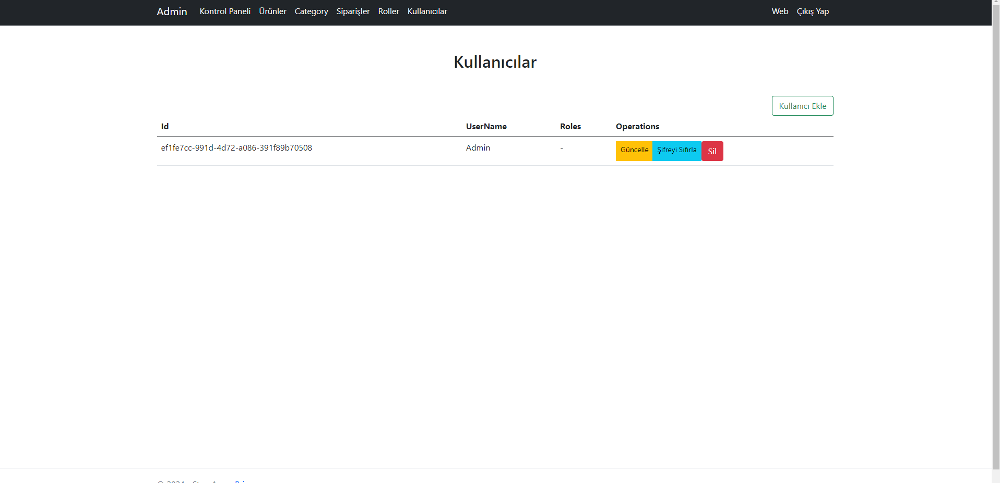
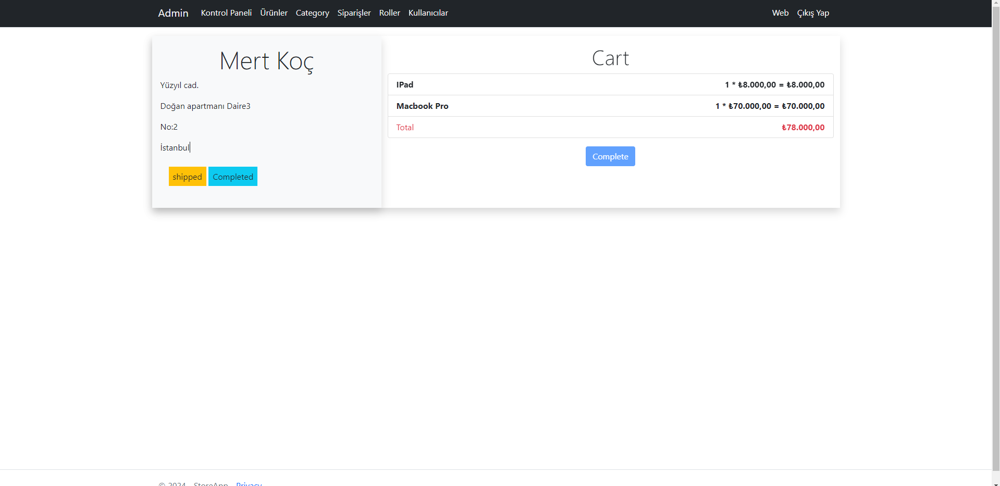

## Başlangıç

Her iki projeyi de yerel olarak kurmak ve çalıştırmak için aşağıdaki adımları izleyiniz.

### Önkoşullar

Projeleri çalıştırmadan önce .NET Core SDK ve SQL Server'ın kurulu olması gerekmektedir.

### Kurulum

#### BTkAkademi

```bash
git clone https://github.com/cetinyazici/ASP.NET-Core-MVC
cd BTkAkademi
dotnet restore
dotnet run
```

#### StoreApp

```bash
git clone https://github.com/mert1981/StoreApp.git
cd StoreApp
dotnet restore
dotnet run
```

### İletişim

- E-posta: mertkoc1981@gmail.com
- LinkedIn: [mertkoc](https://www.linkedin.com/in/mert-ko%C3%A7-a477a0200/)
- GitHub: [mertkoc](https://github.com/mert1981)
